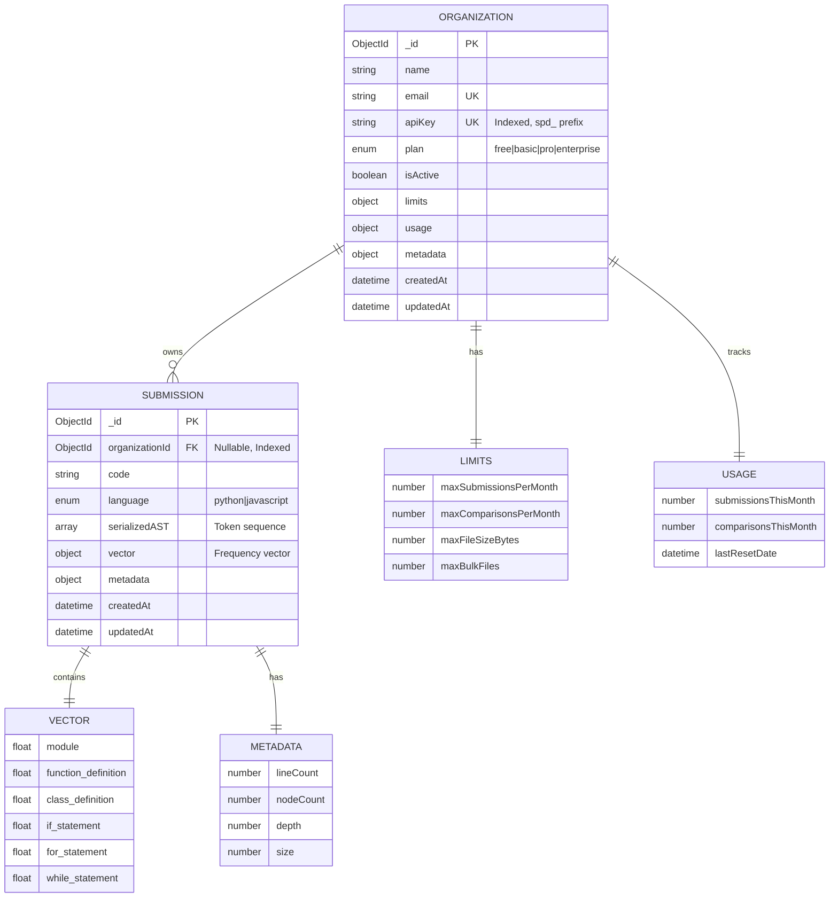
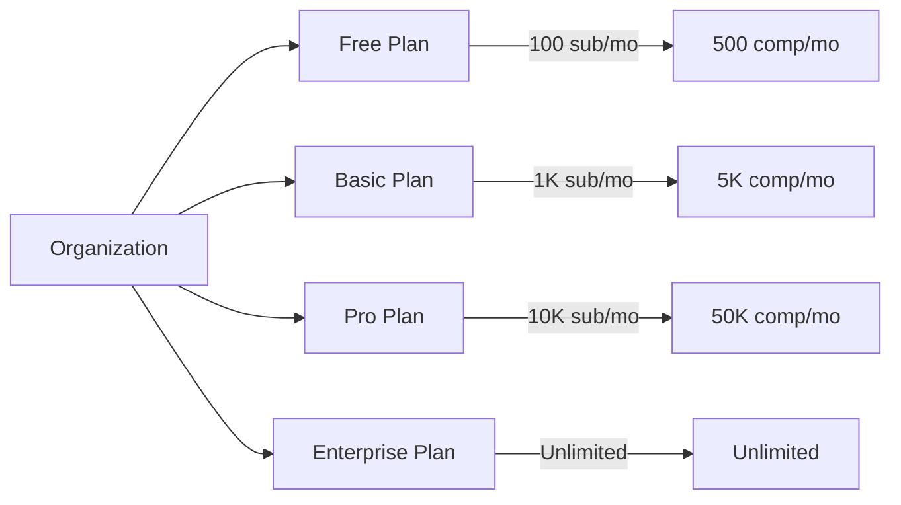
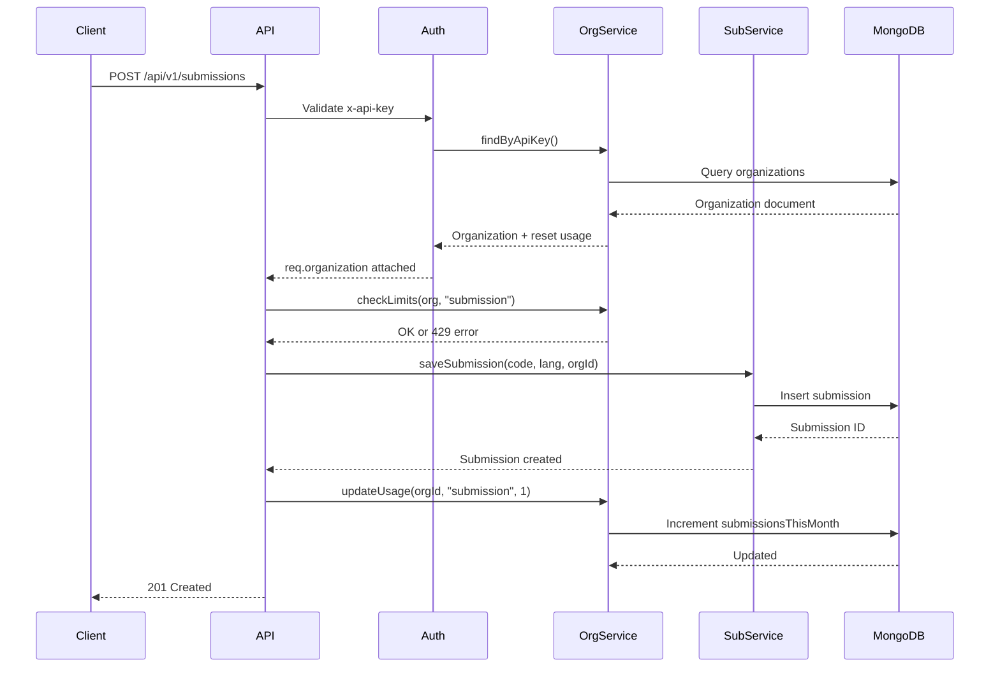
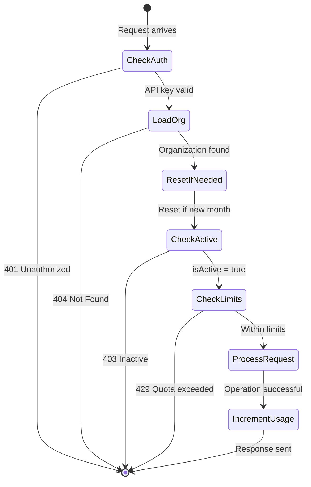
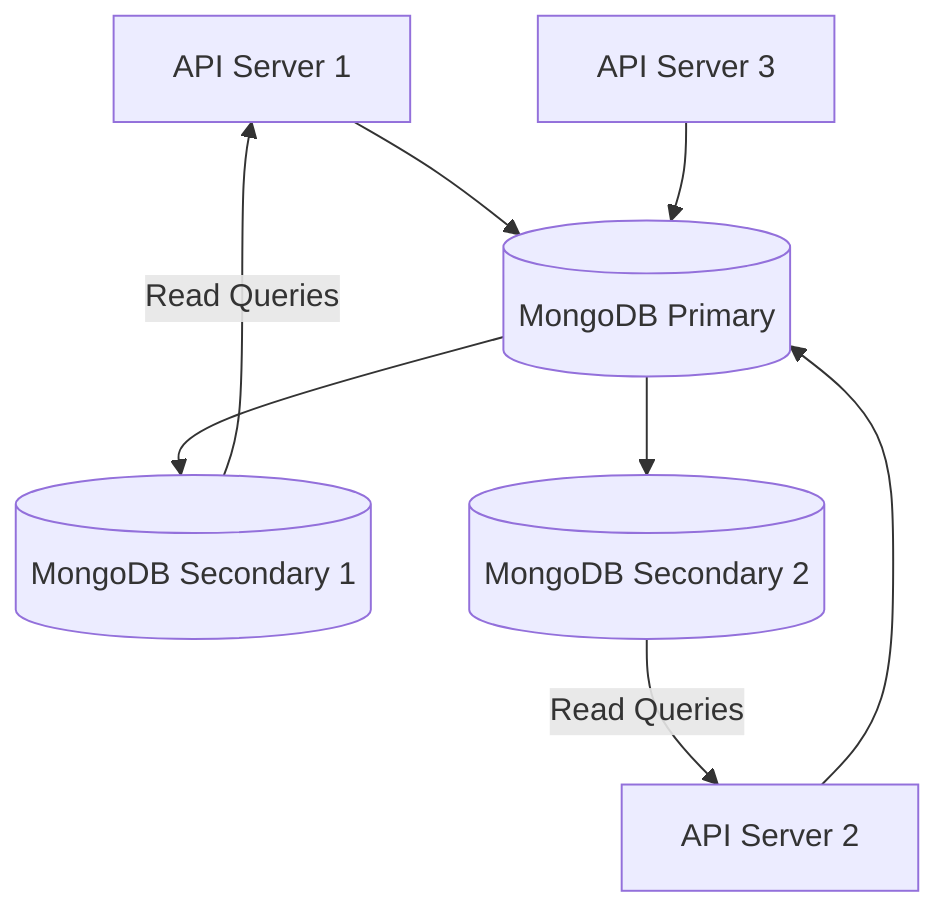
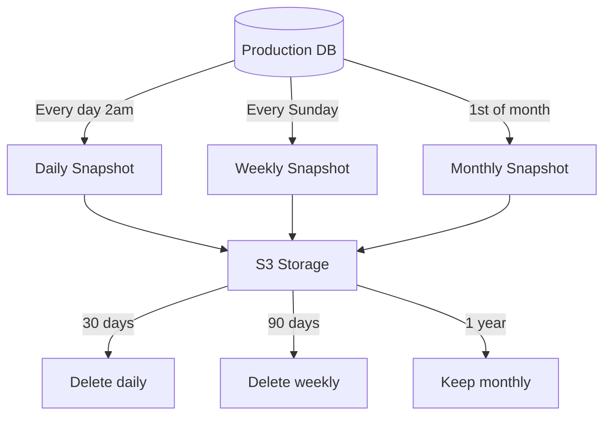

# Entity Relationship Diagram

Database schema for the Structural Plagiarism Detector showing multi-tenant architecture.

## ER Diagram



---

## Detailed Schema

### Organization Collection

**Purpose:** Multi-tenant organization management with plan-based usage limits

**Indexes:**
- `{ apiKey: 1 }` - Unique index for authentication
- `{ email: 1 }` - Unique index for registration validation

**Fields:**

| Field | Type | Description |
|-------|------|-------------|
| `_id` | ObjectId | Primary key |
| `name` | String | Organization name (e.g., "Stanford University") |
| `email` | String | Contact email (unique) |
| `apiKey` | String | Authentication key (`spd_[64-char-hex]`) |
| `plan` | Enum | Subscription tier (free, basic, pro, enterprise) |
| `isActive` | Boolean | Account status (false = suspended) |
| `limits` | Object | Plan-based resource limits |
| `limits.maxSubmissionsPerMonth` | Number | Monthly submission quota |
| `limits.maxComparisonsPerMonth` | Number | Monthly comparison quota |
| `limits.maxFileSizeBytes` | Number | Max file size allowed |
| `limits.maxBulkFiles` | Number | Max files in bulk comparison |
| `usage` | Object | Current month's usage tracking |
| `usage.submissionsThisMonth` | Number | Submissions used this month |
| `usage.comparisonsThisMonth` | Number | Comparisons used this month |
| `usage.lastResetDate` | Date | Last monthly reset timestamp |
| `metadata` | Object | Additional organization data |
| `createdAt` | Date | Account creation timestamp |
| `updatedAt` | Date | Last modification timestamp |

**Instance Methods:**
```typescript
hasExceededSubmissionLimit(): boolean
hasExceededComparisonLimit(): boolean
resetUsageIfNeeded(): void
incrementSubmissionUsage(): void
incrementComparisonUsage(count: number): void
```

---

### Submission Collection

**Purpose:** Store code submissions with AST representations for plagiarism detection

**Indexes:**
- `{ organizationId: 1, language: 1 }` - Compound index for org-scoped queries
- `{ createdAt: 1 }` - Time-based queries

**Fields:**

| Field | Type | Description |
|-------|------|-------------|
| `_id` | ObjectId | Primary key |
| `organizationId` | ObjectId | Foreign key to Organization (nullable) |
| `code` | String | Original source code |
| `language` | Enum | Programming language (python, javascript) |
| `serializedAST` | String[] | Token sequence from AST ("type:depth") |
| `vector` | Object | Depth-weighted frequency vector |
| `vector[nodeType]` | Number | Frequency of each AST node type |
| `metadata` | Object | Code statistics |
| `metadata.lineCount` | Number | Number of lines in code |
| `metadata.nodeCount` | Number | Total AST nodes |
| `metadata.depth` | Number | Maximum AST depth |
| `metadata.size` | Number | Code size in bytes |
| `createdAt` | Date | Submission timestamp |
| `updatedAt` | Date | Last modification timestamp |

---

## Relationships

### One-to-Many: Organization → Submissions
- **Cardinality:** 1:N (One organization has many submissions)
- **Foreign Key:** `Submission.organizationId` references `Organization._id`
- **Optional:** `organizationId` is nullable for backward compatibility
- **Cascade:** No automatic deletion (orphaned submissions retained for auditing)

**Query Examples:**
```javascript
// Get all submissions for an organization
db.submissions.find({ organizationId: orgId, language: "python" })

// Count submissions by organization
db.submissions.aggregate([
  { $group: { _id: "$organizationId", count: { $sum: 1 } } }
])
```

---

## Plan Limits Configuration



### Plan Limits Matrix

| Plan | Submissions | Comparisons | File Size | Bulk Files | Price |
|------|-------------|-------------|-----------|------------|-------|
| **Free** | 100/month | 500/month | 1 MB | 10 | $0 |
| **Basic** | 1,000/month | 5,000/month | 5 MB | 25 | $99/mo |
| **Pro** | 10,000/month | 50,000/month | 10 MB | 50 | $499/mo |
| **Enterprise** | Unlimited | Unlimited | 50 MB | 100 | Custom |

---

## Data Flow Diagram



---

## Usage Tracking Flow



---

## Database Queries Performance

### Common Queries

**1. Authenticate User**
```javascript
// Fast: Uses apiKey index
db.organizations.findOne({ apiKey: "spd_..." })
// Time: ~1-2ms with index
```

**2. Get Organization's Corpus**
```javascript
// Fast: Uses compound index
db.submissions.find({ 
  organizationId: ObjectId("..."),
  language: "python" 
})
// Time: ~5-10ms with index, returns 100-1000 docs
```

**3. Check Usage Statistics**
```javascript
// Fast: Single document lookup
db.organizations.findById(orgId)
// Time: ~1ms with primary key
```

**4. Monthly Usage Reset**
```javascript
// Triggered on auth, checks lastResetDate
if (currentMonth !== lastResetMonth) {
  org.usage.submissionsThisMonth = 0;
  org.usage.comparisonsThisMonth = 0;
  org.usage.lastResetDate = new Date();
  await org.save();
}
// Time: ~2-3ms
```

---

## Index Strategy

### Organizations Collection
```javascript
{
  _id: 1,                    // Primary key (auto)
  apiKey: 1 (unique),        // Fast auth lookup
  email: 1 (unique),         // Registration validation
  createdAt: 1               // Time-based queries
}
```

### Submissions Collection
```javascript
{
  _id: 1,                              // Primary key (auto)
  { organizationId: 1, language: 1 },  // Compound: Org corpus queries
  createdAt: 1                         // Time-based queries
}
```

**Index Sizes:**
- Organizations: ~10KB for 1000 orgs
- Submissions: ~1MB for 10,000 submissions
- Total estimated: ~5MB for 10 orgs × 1000 submissions each

---

## Scaling Considerations

### Horizontal Scaling
- **Stateless API**: All state in MongoDB, easy to add servers
- **Shared Database**: Single MongoDB instance with connection pooling
- **Cache Layer**: Redis for corpus caching (optional)

### Vertical Scaling (Database)


### Sharding Strategy (Future)
- **Shard Key:** `organizationId`
- **Benefit:** Each organization's data on different shard
- **When:** > 1TB data or > 1000 organizations

---

## Data Retention Policy

### Submissions
- **Retention:** Indefinite (for academic integrity)
- **Archival:** Submissions older than 2 years moved to cold storage
- **Deletion:** Manual only, upon organization request

### Organizations
- **Active:** Indefinite
- **Inactive:** Marked `isActive: false`, not deleted
- **Purge:** Only on explicit GDPR request

---

## Backup Strategy



---

## Security Considerations

### Data Access Control
- ✅ **Row-level isolation:** Organizations only see their own submissions
- ✅ **API key encryption:** bcrypt hashing (future enhancement)
- ✅ **Input validation:** Mongoose schemas + Zod validation
- ✅ **SQL injection:** Prevented by Mongoose ODM

### PII Handling
- **Organization email:** Stored encrypted (future)
- **Submission code:** May contain PII, warn users
- **API keys:** Treat as secrets, show only once on creation

---

## Monitoring Queries

### Active Organizations
```javascript
db.organizations.countDocuments({ isActive: true })
```

### Organizations Near Limits
```javascript
db.organizations.find({
  $expr: {
    $gte: ["$usage.submissionsThisMonth", { $multiply: ["$limits.maxSubmissionsPerMonth", 0.9] }]
  }
})
```

### Total Submissions by Language
```javascript
db.submissions.aggregate([
  { $group: { _id: "$language", count: { $sum: 1 } } }
])
```

### Organizations by Plan
```javascript
db.organizations.aggregate([
  { $group: { _id: "$plan", count: { $sum: 1 } } }
])
```

---

## Migration Scripts

### Add organizationId to Existing Submissions
```javascript
// For backward compatibility, existing submissions without orgId
db.submissions.updateMany(
  { organizationId: { $exists: false } },
  { $set: { organizationId: null } }
)
```

### Upgrade Plan
```javascript
// Manual upgrade (admin operation)
db.organizations.updateOne(
  { _id: ObjectId("...") },
  { 
    $set: { 
      plan: "pro",
      "limits.maxSubmissionsPerMonth": 10000,
      "limits.maxComparisonsPerMonth": 50000
    }
  }
)
```

---

**Legend:**
- PK = Primary Key
- FK = Foreign Key
- UK = Unique Key
- Indexed = Database index for fast queries
- Nullable = Optional field
