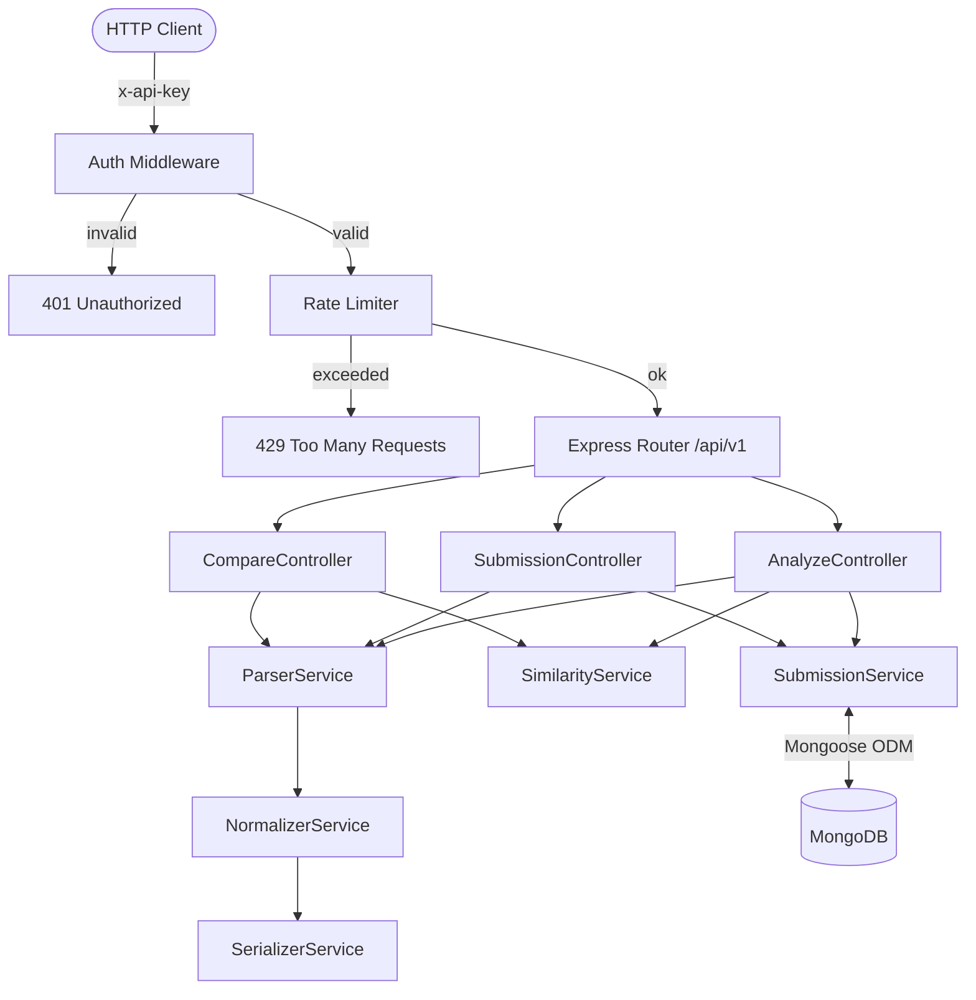
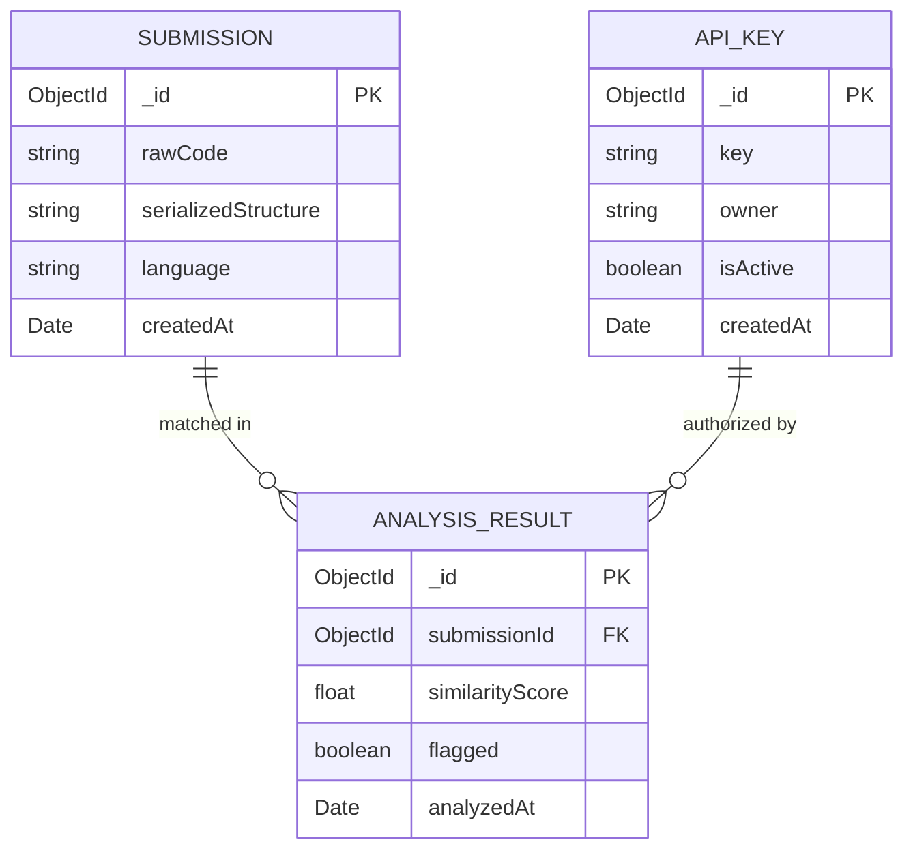
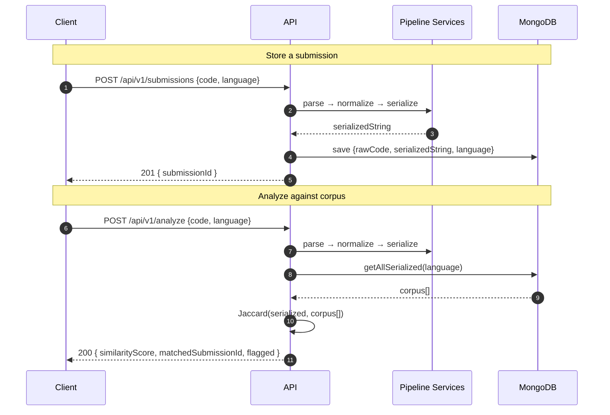

<div align="center">

# Structural Python Code Plagiarism Detector

**A REST API that detects code plagiarism at the structural level — not the surface level.**

_Parses → Normalizes → Serializes → Compares. No ML. No black box. Pure structure._

</div>

---

## 1. Problem Statement

Students and competitive programmers frequently submit plagiarised code that's been superficially mutated — variable renames, whitespace tweaks, comment additions — to fool text-based checkers. **Tools like MOSS compare raw text and fail against these trivial transformations.**

| Approach                 | Where it breaks                                 |
| ------------------------ | ----------------------------------------------- |
| Text diff / string match | Variable rename defeats it                      |
| Token-based (MOSS)       | Still surface-level                             |
| ML embedding models      | Non-deterministic, expensive, opaque            |
| **This API**             |  Immune to all above — compares AST structure |

**Target users:** Universities, coding bootcamps, competitive programming judges, LMS platforms (Moodle, Canvas).

---

## 2. Solution

Parse Python code with **Tree-sitter**, strip all surface details (names, literals, whitespace) into a normalized **Intermediate Representation**, serialize it to a **canonical string**, then compute **Jaccard similarity** against stored submissions.

```
Raw Code
   ↓  Tree-sitter
Abstract Syntax Tree (AST)
   ↓  NormalizerService
Intermediate Representation (IR)
   ↓  SerializerService
Canonical String
   ↓  SimilarityService
Jaccard Score ∈ [0, 1]
```

Two structurally identical programs produce the **same canonical string** regardless of identifier names, comments, or whitespace.

---

## 3. Architecture



### Layers

| Layer           | Files                  | Responsibility                               |
| --------------- | ---------------------- | -------------------------------------------- |
| **Routes**      | `routes/*.routes.ts`   | Map HTTP verbs to controllers                |
| **Controllers** | `controllers/*.ts`     | Validate input, orchestrate services         |
| **Services**    | `services/*.ts`        | Pure business logic, no Express types        |
| **Models**      | `models/Submission.ts` | Mongoose schema + indexes                    |
| **Middlewares** | `middlewares/*.ts`     | Auth, rate limiting, logging, error handling |

---

## 4. Database Design



**Indexes on `Submission`:** `language` (corpus queries) + `createdAt DESC` (range queries)

---

## 5.  Request Flow



---

## 6.  API Reference

All endpoints require the `x-api-key` header.

### `POST /api/v1/analyze`

Analyze code against the stored corpus. Returns the best match and similarity score.

```jsonc
// Request
{ "code": "def foo(x): return x * 2", "language": "python" }

// Response 200
{ "similarityScore": 0.87, "matchedSubmissionId": "64ab3f...", "flagged": true }
```

### `POST /api/v1/submissions`

Store a new code submission in the corpus.

```jsonc
// Request
{ "code": "def bar(n): return n + 1", "language": "python" }

// Response 201
{ "submissionId": "64ab3f..." }
```

### `POST /api/v1/compare`

Directly compare two snippets without storing either.

```jsonc
// Request
{ "codeA": "def foo(x): return x*2", "codeB": "def baz(y): return y*2", "language": "python" }

// Response 200
{ "similarityScore": 0.95 }
```

### `GET /api/v1/submissions/:id`

Fetch a stored submission.

```jsonc
// Response 200
{
  "_id": "64ab3f...",
  "language": "python",
  "createdAt": "2026-02-28T12:00:00Z",
}
```

---

## 7.  Folder Structure

```
src/
├── app.ts                    # Express setup — CORS, body parser, routes, error handler
├── server.ts                 # Entry point — MongoDB connect → HTTP listen
├── config/
│   └── index.ts              # Typed env config loader
├── controllers/
│   ├── AnalyzeController.ts
│   ├── SubmissionController.ts
│   └── CompareController.ts
├── services/
│   ├── ParserService.ts      # Tree-sitter → AST
│   ├── NormalizerService.ts  # AST → IRNode (strips names/literals)
│   ├── SerializerService.ts  # IRNode → canonical string
│   ├── SimilarityService.ts  # Jaccard similarity
│   └── SubmissionService.ts  # MongoDB CRUD
├── models/
│   └── Submission.ts         # Mongoose schema + indexes
├── routes/
│   ├── analyze.routes.ts
│   ├── submission.routes.ts
│   └── compare.routes.ts
├── middlewares/
│   ├── authMiddleware.ts     # x-api-key validation
│   ├── rateLimiter.ts        # express-rate-limit
│   ├── requestLogger.ts      # Morgan
│   └── errorHandler.ts       # Centralized error shape
├── types/
│   └── index.ts              # All shared TS interfaces
├── utils/                    # Shared helpers (future)
└── adapters/                 # Multi-language grammar adapters (future)
```

---

## 8.  Tech Stack

|               | Technology                   |
| ------------- | ---------------------------- |
| Runtime       | Node.js 20 + TypeScript 5    |
| Framework     | Express.js 4                 |
| Parser        | Tree-sitter + Python grammar |
| Database      | MongoDB 7 + Mongoose 8       |
| Validation    | Zod                          |
| Rate Limiting | express-rate-limit           |
| Logging       | Morgan                       |

---

## 9.  Getting Started

```bash
# 1. Install dependencies
npm install

# 2. Configure environment
cp .env.template .env
# Edit .env — set MONGO_URI and API_KEY

# 3. Start MongoDB (macOS)
brew services start mongodb-community

# 4. Run dev server with hot reload
npm run dev
# → http://localhost:3000/health
```

### Environment Variables

| Variable                  | Description                    | Default                                         |
| ------------------------- | ------------------------------ | ----------------------------------------------- |
| `PORT`                    | Server port                    | `3000`                                          |
| `MONGO_URI`               | MongoDB connection string      | `mongodb://localhost:27017/plagiarism-detector` |
| `API_KEY`                 | Secret for `x-api-key` header  | —                                               |
| `RATE_LIMIT_WINDOW_MS`    | Rate limit window (ms)         | `60000`                                         |
| `RATE_LIMIT_MAX_REQUESTS` | Max requests per window        | `100`                                           |
| `ALLOWED_ORIGINS`         | CORS origins (comma-separated) | `http://localhost:3000`                         |
| `NODE_ENV`                | `development` or `production`  | `development`                                   |

---

## 10.  Progress

| Checkpoint                            | Status     |
| ------------------------------------- | ---------- |
| Architecture + ER + Sequence diagrams |  Done    |
| Folder structure + all skeletons      |  Done    |
| Mongoose model + indexes              |  Done    |
| Auth, rate limiter, error handler     |  Done    |
| `ParserService` — Tree-sitter AST     |  Next    |
| `NormalizerService` — IR generation   |  Next    |
| `SerializerService` — canonical form  |  Next    |
| `SimilarityService` — Jaccard         |  Next    |
| Controllers fully implemented         | ⏳ Pending |
| Deployed (Railway / Render)           | ⏳ Pending |

---

## 11.  Future Scope

- **MinHash + LSH** — sub-linear corpus lookups past 10k submissions
- **Multi-language** — Java, C++, JavaScript via Tree-sitter grammar adapters
- **BullMQ job queue** — async analysis for large corpora
- **Webhook callbacks** — notify when plagiarism is detected
- **Diff highlighting** — pinpoint which AST subtrees matched

---

## 12.  Known Limitations

- Python only (grammar adapter pattern is in place for extension)
- Jaccard is O(n) over corpus — use MinHash for scale
- Heavily obfuscated code (single-letter names + complex nesting) may evade detection
- `serializedStructure` is stored uncompressed

---

<div align="center">
Made with  — AST-first, no black box, fully auditable
</div>
